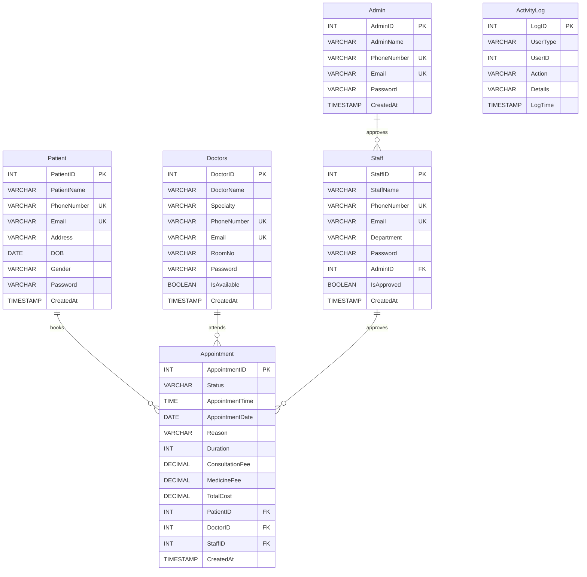
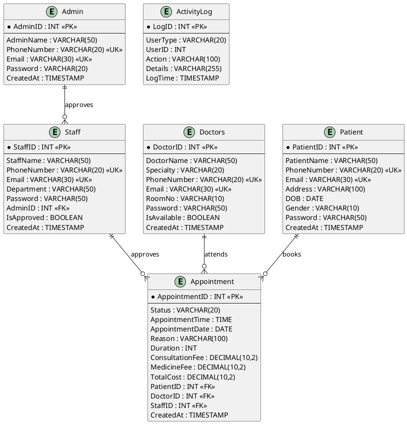

# 🗂️ ENTITY RELATIONSHIP DIAGRAM (ERD)
## Hospital Appointment Booking System

---

## 📊 MERMAID ERD (Copy to https://mermaid.live)



---

## 🔗 PLANTUML ERD (Copy to https://plantuml.com)



---

## 🎨 ASCII ART ERD (Horizontal Layout)

```
┌─────────────────────┐
│      ADMIN          │
├─────────────────────┤
│ PK: AdminID         │
│     AdminName       │
│ UK: PhoneNumber     │
│ UK: Email           │
│     Password        │
│     CreatedAt       │
└──────────┬──────────┘
           │ 1
           │ approves
           │ N
           ▼
┌─────────────────────┐          ┌─────────────────────┐          ┌─────────────────────┐
│      STAFF          │          │      PATIENT        │          │      DOCTORS        │
├─────────────────────┤          ├─────────────────────┤          ├─────────────────────┤
│ PK: StaffID         │          │ PK: PatientID       │          │ PK: DoctorID        │
│     StaffName       │          │     PatientName     │          │     DoctorName      │
│ UK: PhoneNumber     │          │ UK: PhoneNumber     │          │     Specialty       │
│ UK: Email           │          │ UK: Email           │          │ UK: PhoneNumber     │
│     Department      │          │     Address         │          │ UK: Email           │
│     Password        │          │     DOB             │          │     RoomNo          │
│ FK: AdminID         │          │     Gender          │          │     Password        │
│     IsApproved      │          │     Password        │          │     IsAvailable     │
│     CreatedAt       │          │     CreatedAt       │          │     CreatedAt       │
└──────────┬──────────┘          └──────────┬──────────┘          └──────────┬──────────┘
           │ N                              │ 1                              │ 1
           │ approves                       │ books                          │ attends
           │                                │                                │
           │                                ▼                                ▼
           └─────────────────────►  ┌─────────────────────┐  ◄──────────────┘
                                    │    APPOINTMENT      │
                                    ├─────────────────────┤
                                    │ PK: AppointmentID   │
                                    │     Status          │
                                    │     AppointmentTime │
                                    │     AppointmentDate │
                                    │     Reason          │
                                    │     Duration        │
                                    │     ConsultationFee │
                                    │     MedicineFee     │
                                    │     TotalCost       │
                                    │ FK: PatientID       │
                                    │ FK: DoctorID        │
                                    │ FK: StaffID         │
                                    │     CreatedAt       │
                                    └─────────────────────┘

                                    ┌─────────────────────┐
                                    │   ACTIVITYLOG       │
                                    ├─────────────────────┤
                                    │ PK: LogID           │
                                    │     UserType        │
                                    │     UserID          │
                                    │     Action          │
                                    │     Details         │
                                    │     LogTime         │
                                    └─────────────────────┘
                                    (Tracks all user actions)
```

---

## 📋 DETAILED RELATIONSHIP TABLE

| Relationship | From Entity | To Entity   | Cardinality | Description                           |
|--------------|-------------|-------------|-------------|---------------------------------------|
| Approves     | Admin       | Staff       | 1:N         | One admin approves many staff         |
| Books        | Patient     | Appointment | 1:N         | One patient books many appointments   |
| Attends      | Doctors     | Appointment | 1:N         | One doctor attends many appointments  |
| Approves     | Staff       | Appointment | 1:N         | One staff approves many appointments  |
| Logs         | All Users   | ActivityLog | N:N         | All users generate activity logs      |

---

## 🔑 KEY LEGEND

- **PK** = Primary Key (Unique identifier)
- **FK** = Foreign Key (References another table)
- **UK** = Unique Key (Must be unique, no duplicates)
- **1:N** = One-to-Many relationship
- **N:1** = Many-to-One relationship
- **N:N** = Many-to-Many relationship

---

## 💡 BUSINESS RULES

1. **Admin → Staff**
   - One admin can approve multiple staff accounts
   - Staff must be approved by an admin before accessing system
   - If admin is deleted, staff.AdminID becomes NULL

2. **Patient → Appointment**
   - One patient can book multiple appointments
   - Each appointment belongs to exactly one patient
   - If patient is deleted, all their appointments are deleted (CASCADE)

3. **Doctor → Appointment**
   - One doctor can have multiple appointments
   - Each appointment is assigned to exactly one doctor
   - If doctor is deleted, all their appointments are deleted (CASCADE)

4. **Staff → Appointment**
   - One staff can approve multiple appointments
   - Appointments can exist without staff approval (NULL allowed)
   - If staff is deleted, appointment.StaffID becomes NULL

5. **Cost Calculation**
   - ConsultationFee = Duration × RM1.00 per minute
   - MedicineFee = Based on appointment reason (predefined rates)
   - TotalCost = ConsultationFee + MedicineFee

---

## 📊 CARDINALITY SUMMARY

```
Admin (1) ────────── approves ──────────► Staff (Many)
                                            │
                                            │ N:1
                                            │
Patient (1) ──────── books ────────────► Appointment (Many)
                                            ▲
                                            │ N:1
                                            │
Doctor (1) ───────── attends ──────────────┘
                                            ▲
                                            │ N:1 (optional)
                                            │
Staff (1) ────────── approves ──────────────┘

All Users ─────────── logs ──────────────► ActivityLog (Many)
```

---

## 🎯 NORMALIZATION LEVEL

**✅ Third Normal Form (3NF)**

1. **1NF:** All tables have atomic values (no repeating groups)
2. **2NF:** All non-key attributes depend on entire primary key
3. **3NF:** No transitive dependencies (no non-key depends on another non-key)

**Integrity Features:**
- Referential integrity via Foreign Keys
- Entity integrity via Primary Keys
- Domain integrity via CHECK constraints
- User-defined integrity via UNIQUE constraints

---

**Generated:** 2026-01-12  
**Database:** MySQL/MariaDB (InnoDB)  
**Total Entities:** 6  
**Total Relationships:** 4  
**Normalization:** 3NF


