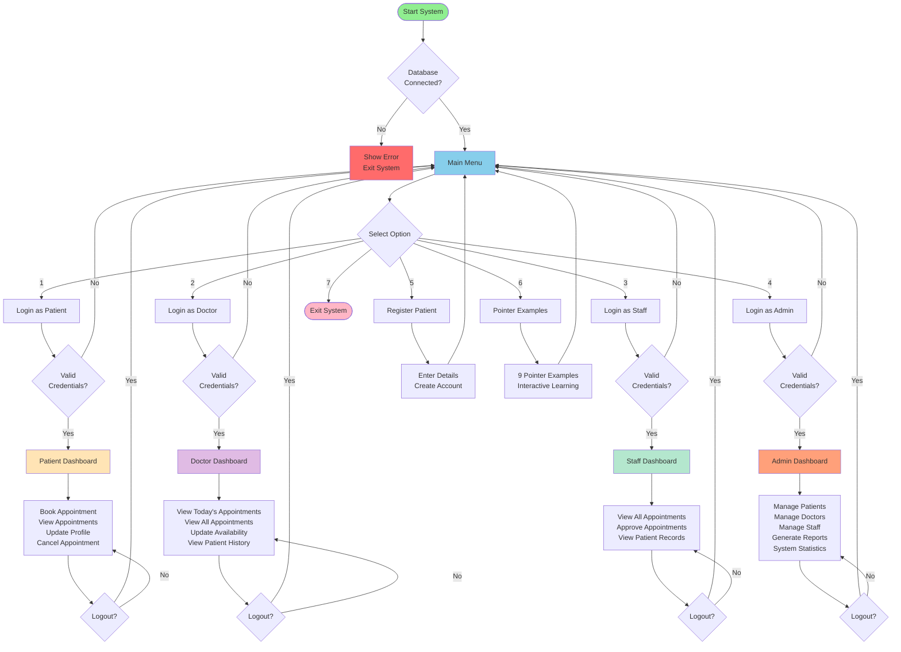

# Hospital Appointment Booking System - Flowchart

## Mermaid Diagram Code



---

## Text-Based Flowchart

```
┌─────────────────────────────────────────────────────────────────┐
│                    HOSPITAL APPOINTMENT SYSTEM                  │
└─────────────────────────────────────────────────────────────────┘
                              │
                              ▼
                    ┌──────────────────┐
                    │  Start System    │
                    └────────┬─────────┘
                             │
                             ▼
                    ┌──────────────────┐
                    │  Database        │
                    │  Connection      │
                    └────────┬─────────┘
                             │
                  ┌──────────┴──────────┐
                  │                     │
             [SUCCESS]              [FAILED]
                  │                     │
                  ▼                     ▼
         ┌─────────────────┐    ┌──────────────┐
         │   MAIN MENU     │    │  Show Error  │
         │                 │    │  Exit System │
         └────────┬────────┘    └──────────────┘
                  │
       ┌──────────┼──────────┬──────────┬──────────┬──────────┐
       │          │          │          │          │          │
       ▼          ▼          ▼          ▼          ▼          ▼
   ┌───────┐ ┌───────┐ ┌───────┐ ┌───────┐ ┌────────┐ ┌──────┐
   │Login  │ │Login  │ │Login  │ │Login  │ │Register│ │Pointer│
   │Patient│ │Doctor │ │Staff  │ │Admin  │ │Patient │ │Examples│
   └───┬───┘ └───┬───┘ └───┬───┘ └───┬───┘ └────┬───┘ └───┬──┘
       │         │         │         │          │         │
       ▼         ▼         ▼         ▼          │         │
   [Auth?]   [Auth?]   [Auth?]   [Auth?]       │         │
       │         │         │         │          │         │
       ▼         ▼         ▼         ▼          ▼         ▼
┌──────────┐┌──────────┐┌──────────┐┌──────────┐    [Back to Menu]
│ PATIENT  ││ DOCTOR   ││  STAFF   ││  ADMIN   │
│DASHBOARD ││DASHBOARD ││DASHBOARD ││DASHBOARD │
└────┬─────┘└────┬─────┘└────┬─────┘└────┬─────┘
     │           │           │           │
     ▼           ▼           ▼           ▼
┌──────────┐┌──────────┐┌──────────┐┌──────────┐
│• Book    ││• View    ││• View All││• Manage  │
│  Appoint ││  Today's ││  Appoint ││  Patients│
│• View    ││  Appoint ││• Approve ││• Manage  │
│  Appoint ││• View All││  Appoint ││  Doctors │
│• Update  ││  Appoint ││• View    ││• Manage  │
│  Profile ││• Update  ││  Records ││  Staff   │
│• Cancel  ││  Status  ││• Logout  ││• Generate│
│• Logout  ││• Logout  ││          ││  Reports │
│          ││          ││          ││• Stats   │
└──────────┘└──────────┘└──────────┘│• Logout  │
                                    └──────────┘
```

---

## Simplified Process Flow

```
START
  ↓
CONNECT TO DATABASE
  ↓
MAIN MENU (7 Options)
  ├─→ [1] Patient Login → Patient Dashboard
  │                        ├─ Book Appointment
  │                        ├─ View Appointments  
  │                        ├─ Update Profile
  │                        └─ Logout
  │
  ├─→ [2] Doctor Login → Doctor Dashboard
  │                       ├─ View Today's Appointments
  │                       ├─ View All Appointments
  │                       ├─ Update Availability
  │                       └─ Logout
  │
  ├─→ [3] Staff Login → Staff Dashboard
  │                      ├─ View All Appointments
  │                      ├─ Approve Appointments
  │                      └─ Logout
  │
  ├─→ [4] Admin Login → Admin Dashboard
  │                      ├─ Manage Patients
  │                      ├─ Manage Doctors
  │                      ├─ Manage Staff
  │                      ├─ Generate Reports
  │                      ├─ System Statistics
  │                      └─ Logout
  │
  ├─→ [5] Register Patient → Create Account → Back to Menu
  │
  ├─→ [6] Pointer Examples → 9 Interactive Demos → Back to Menu
  │
  └─→ [7] Exit → END
```


